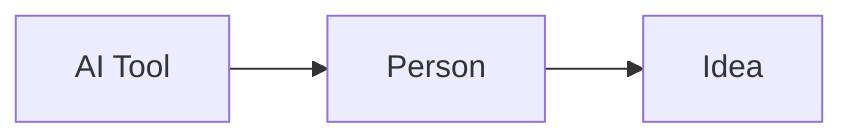

# AI Events

Date: September 15, 2026

AI news shows new tools and ideas. These tools can help people learn and create.

## Why It Matters

It's no secret that AI is rapidly changing how people work, learn, and share ideas. Thus, it is important to stay informed of recent advancements, as well as rising ethical concerns.

## Key Points

- Learn what AI can do.
- Use AI with care.
- Check information before sharing.

## Top Stories (as of September 2026)

- [OpenAI reveals cases of "concerning" AI behavior amid new disclosure system:](https://www.theguardian.com/technology/2026/sep/17/openai-reports-concerning-ai-behaviour-jailbreak-talking-to-other-agents)
- [Anthropic CEO calls for "slowdown" of AI model development](https://www.bloomberg.com/news/articles/2026-09-12/anthropic-ceo-says-it-s-time-to-slow-pace-of-improving-ai-models)

[Back to README](../README.md)

## Simple Diagram

