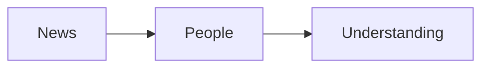

# Global Event

Date: September 15, 2026

People around the world follow important events. News can help us understand what is happening.

## Why It Matters

Global events can affect many people and communities.

## Key Points

- Read trusted news sources.
- Check the date of each story.
- Talk about what you learn.

## News Story Links

- [News story title](https://example.com)
- [Another news story title](https://example.com)

[Back to README](../README.md)

## Simple Diagram

