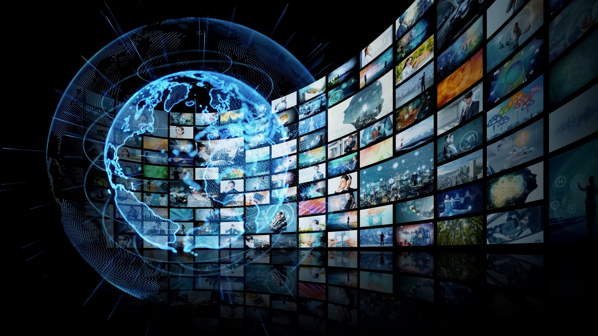
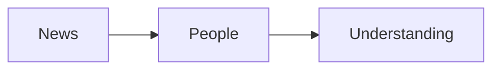

# Global Events

Know what's going on around the world.

## Why It Matters

Global events can affect many people and communities, no matter where they are. News can help us understand what is happening around us and what's next to come.

## Key Points

- Read trusted news sources.
- Check the date of each story.
- Talk about what you learn.

## Top Stories (as of September 2026)

- [China tightens travel restrictions on citizens:](https://www.bbc.com/news/articles/cqe8x6gkk250o)
- [Germany's far-right AfD party wins parliamentary election:](https://www.pbs.org/newshour/show/far-right-afd-win-signals-shift-in-germany-raises-alarm-in-europe)

[Back to README](../README.md)

## Simple Diagram

